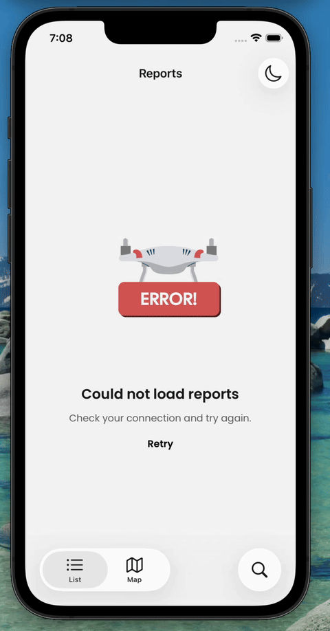

# Fairsight

React Native drone inspection report viewer. Browse inspection reports, explore sites on a map, and query an AI assistant with full report context — streaming responses over SSE.

---

## Project structure

```
fairfleet/
├── Fairsight/   React Native / Expo mobile app
└── api/         Express mock API server
```

### `Fairsight/`

The mobile application. Built with Expo (bare workflow) targeting iOS and Android. Requires a custom dev client — does not run in Expo Go.

### `api/`

A local mock server that provides the report data and hosts the AI chat endpoint. Intended only to support the mobile evaluation; the goal is minimum viable complexity.

---

## Stack

### Mobile

| Concern | Choice |
|---|---|
| Framework | React Native 0.83 / Expo SDK 55 |
| Language | TypeScript (strict) |
| Navigation | React Navigation v8 — native stack + bottom tabs |
| Data fetching | TanStack Query v5 |
| HTTP client | apisauce (axios wrapper) |
| Maps (iOS) | react-native-maps — Apple Maps, no API key required |
| Maps (Android) | @rnmapbox/maps — Mapbox GL |
| AI chat | Streaming SSE over fetch + ReadableStream |
| Markdown | react-native-markdown-display |
| Keyboard | react-native-keyboard-controller + Reanimated |
| Storage | react-native-mmkv |
| UI extras | @callstack/liquid-glass (iOS 26+) |

### API

| Concern | Choice |
|---|---|
| Runtime | Node.js 18+ |
| Framework | Express 4 |
| Language | TypeScript via tsx (no build step) |
| Validation | Zod v4 |
| AI | Vercel AI SDK + OpenAI |
| Streaming | Server-Sent Events |

---

## Getting started

### API

```bash
cd api
cp .env.example .env   # add your OPENAI_API_KEY
npm install
npm start              # http://localhost:3000
```

### Mobile

```bash
cd Fairsight
cp .env.example .env   # add Mapbox tokens
npm install
npx expo prebuild      # generates android/ and ios/
npm run ios            # or npm run android
```

> Android requires `EXPO_PUBLIC_MAPBOX_ACCESS_TOKEN` and optionally `RNMAPBOX_MAPS_DOWNLOAD_TOKEN` in `.env` before prebuild. See `Fairsight/docs/map-strategy.md`.

---

## Demos


### Environment

Screenshots and recordings were captured on the following setup:

| | |
|---|---|
| **Machine** | MacBook Air (M1) — 8 GB RAM |
| **macOS** | 26.3.1 (Build 25D2128) |
| **iOS simulator** | iPhone 16e — iOS 26.3.1 |
| **Android emulator** | Medium Phone (Generic, arm64-v8a) — Android API 37 (Google APIs) |

### iOS

**Light mode — report list & detail**


**Dark mode**


**Error state**



### Android

**Report list**


**Map view**


---

## Docs

Detailed rationale for each area lives in the `docs/` folders.

**Mobile** (`Fairsight/docs/`)
- [`api-layer.md`](Fairsight/docs/api-layer.md) — API layer, types, search, pull to refresh
- [`ui-ux.md`](Fairsight/docs/ui-ux.md) — component architecture, list, map, native components
- [`map-strategy.md`](Fairsight/docs/map-strategy.md) — Mapbox / Apple Maps platform split
- [`chat-sse.md`](Fairsight/docs/chat-sse.md) — SSE streaming, keyboard control, markdown

**API** (`api/docs/`)
- [`typescript-migration.md`](api/docs/typescript-migration.md) — TypeScript migration rationale
- [`chat-conversation.md`](api/docs/chat-conversation.md) — conversation model and streaming
